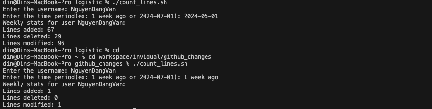

# github_changes
## How to count the number of changes
```
cd github_changes
```
Grant execute permission to the script
```
chmod +x count_lines.sh
```
Run the script
```
./count_lines.sh
Enter the username: NguyenDangVan
Enter the time period(ex: 1 week ago or 2024-07-01): 1 week ago
Weekly stats for user NguyenDangVan:
Lines added: 1
Lines deleted: 0
Lines modified: 1
```

